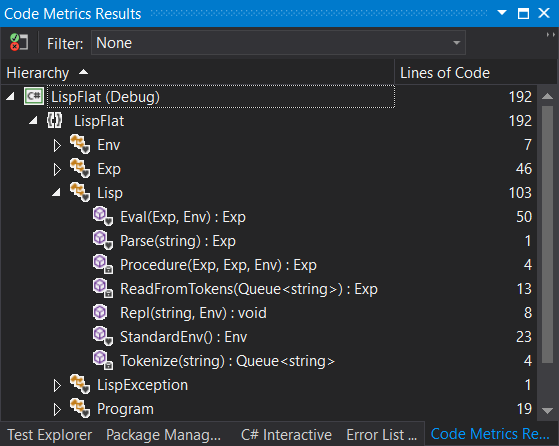

# (How to Write a (Lisp) Interpreter (in C#))
#### LispFlat: A C# port of Peter Norvig's Toy Lisp #### 

## Introduction ##
This is a quick port to C#, from Python, of Peter Norvig's famous [lis.py](https://github.com/norvig/pytudes/blob/master/py/lis.py) 
toy Lisp (Scheme) interpreter.

The purpose of this project was, primarily, to build an interpreter again, having not written 
one in years. I have been considering getting back into Lisp programming and there is no better 
way than to write an interpreter to remind oneself as to the basics! 

Secondly I enjoy learning about code and, surprisingly, find that it is easier to translate 
from Python to C# rather than from C or C++, two languages I used to know very well! As you 
will see here, the code quite reasonably mirror's python with some caveats, of course.

Finally the original code is a toy interpretor that is, it is a *toy*. It had very little error
checking with very limited functionality (with which you can still go surprisingly far) 
and this project mirrors those limitations too. It is a fun and not a professional project. 
Later, Peter enhanced this with [lisp.py](https://github.com/norvig/pytudes/blob/master/py/lispy.py), I might one day revisit this project and update it to that level, but that is not for today.

## Development ##

I recommend that you read Peter's [notes](http://norvig.com/lispy.html) on his project first.

One of my secondary challenges was, whist not playing code golf, to get this solution to be as small as possible. I could not hope to reach 
Peter's less than 90 lines of code but this solution is around 180 lines of code including tests and the consolde test harness, so going from 
a dynamic to statically typed language (and one with a poor type system and poor type inference
compared to, say, F#) I consider this pretty good :-) I have even retained Peter's original 
comments and most of the variable names, whre possible and useful. 

### Exp ###

The code follows much of the original format except, not being dynamically typed,  an Exp 
(Expressions) class was added to handle the different types of S-Expressions - atoms and lists.

This has: `double` for numbers (the python has ints as well); `string` is used as the symbol 
type; `bool` (`#t` and `#f`- that are not in the Python) has been added; a type to 
handle the procedures ; and a `List<Exp>` to recursively store the whole Abstract Syntax Tree.

```csharp
internal enum Type { Num, Bool, Sym, List, Proc }

internal class Exp
{
    public string Sym { get; }
    public double Num { get; }
    public bool Is { get; }
    public List<Exp> List { get; }
    public Func<Exp, Env, Exp> Proc { get; }
    public Type Type;

    // Atoms
    public Exp(string sym) { Sym = sym; Type = Type.Sym; }
    public Exp(double dbl) { Num = dbl; Type = Type.Num; }
    public Exp(bool @bool) { Is = @bool; Type = Type.Bool; }
    // lists
    public Exp(List<Exp> exp) { List = exp; Type = Type.List; }
    public Exp(IEnumerable<Exp> exp) { List = exp.ToList(); Type = Type.List; }
    // procs
    public Exp(Func<Exp, Env, Exp> inv) { Proc = inv; Type = Type.Proc; }
    
    // wrappers
    public static Exp Func(Func<Exp, Env, bool> proc) => new Exp((a, e) => new Exp(proc(a, e)));
    public static Exp Func(Func<Exp, Env, double> proc) => new Exp((a, e) => new Exp(proc(a, e)));
    public static Exp Func(Func<Exp, Env, IEnumerable<Exp>> proc) => new Exp((a, e) => new Exp(proc(a, e)));
    public static Exp Func(Func<Exp, Env, Exp> proc) => new Exp(proc);

    // list ops
    public int Count => List?.Count ?? -1;
    public Exp this[int i] => List[i];

    // "Numbers become numbers; true/false becomes bools; every other token is a symbol."
    public static Exp Atom(string token)
    {
        if (double.TryParse(token, out double resDbl))
            return new Exp(resDbl);
        if (token == "#t")
            return new Exp(true);
        if (token == "#f")
            return new Exp(false);
        if (token == "") // nil or ()
            return new Exp(new List<Exp>(0));
        return new Exp(token);
    }

    public override string ToString()
    {
        if (Type == Type.Bool)
            return Is ? "#t" : "#f";
        if (Type == Type.Num)
            return Num.ToString();
        if (Type == Type.Sym)
            return Sym;
        if (Type == Type.Proc)
            return "<function>"; ;
        if (Type == Type.List)
            return Count > 0 ? $"({string.Join(" ", List.Select(i => i.ToString()))})" : "";
        return "stringify error";
    }
}
 ```
This uses both atoms (`Sym`, `Bool` and `Num`) and `List` here and not Scheme's pairs. In Scheme, the empty list 
`()` (`nil` in Lisp) is both an atom and a list, here it is only a list. Note that it is explicitly
captured in `Atom()`. This was one of those gotchas in this port.  

This solution uses the .Net `List<T>` type as the underlying data structure for Lisp lists. This
is obviously inefficient, especially seeing (later) both how `cdr` is implemented - as `List.Skip(1).ToList()` and 
that `cons` uses Linq's `Prepend()` onto a `List<Exp>`, unlike Lisp, where the prepend opration is
cheaper, it is the the Append/Add operation that is cheaper with .Net `List<T>`
 
The main pain point was the need to use wrappers to handle the differing output types from 
Standard Procedures, which are represented as `Func<Exp,Env,Exp>` and the need to
wrap those again in order to store them in the same Environment dictionary (see below) as other 
Symbol Expression pairs. (With more time than allowed for this project, a better soltuoin might be 
developed). 

Finally, it was more logical to move a couple of methods into this class. These were the lisp string 
output from the REPL and atom function used to create atom Exp types.
 
 ### Environment Dictionary ###
 ```csharp
//"An environment: a dict of {'var':val} pairs, with an outer Env."
internal class Env : Dictionary<string, Exp>
{
    Env _outer;

    public Env(Exp parms = null, Exp args = null, Env outer = null)
    {
        if (parms != null)           
            foreach (var (parm, arg) in parms.List.Zip(args.List, (p, a) => (p.Sym, a)))
                Add(parm, arg);
        _outer = outer;
    }

    //"Find the innermost Env where var appears."
    public Env Find(string var) => 
        TryGetValue(var, out Exp val) ? this: 
        _outer != null                ? _outer.Find(var) 
                                      : throw new LispException($"Lookup {var} failed");
}
 ```

This is the environment dictionary structure that holds all the primitive operations, as well 
as all the user defined operations named lists and atoms and also named lambda functions. 

The optional args are for local function scoping of lambdas - assigning values to function arguments.
This is the purpose of the zip. This will be discussed when we get to Lambdas below. This is why
there are nested environments, so that the local lambda scope does not pollute the general 
environment and that the lambda has its arguments bound in the current context.
 
(Also added was a minor extra peice of error checking,  it was really useful to see key misses 
in debugging). 
 
 ### (Parse(Tokenize(Read))) ###
 ```csharp
 // Read a Scheme expression from a string
 internal static Exp Parse(string program) => ReadFromTokens(Tokenize(program));

 // Convert a string to a queue of tokens
 static Queue<string> Tokenize(string s)
 {
     if (s == null)
         throw new LispException("no code");
     return new Queue<string>(s.Replace("(", " ( ").Replace(")", " ) ")
     .Split(new char[] { ' ' }, StringSplitOptions.RemoveEmptyEntries));
 }

 // Read an expressions from a sequence of tokens
 static Exp ReadFromTokens(Queue<string> tokens)
 {
     if (!tokens.Any())
         throw new LispException("unexpected EOF while reading");

     var token = tokens.Dequeue();
     if ("(" == token)
     {
         var L = new List<Exp>();
         while (tokens.Peek() != ")")
             L.Add(ReadFromTokens(tokens));
         tokens.Dequeue(); // ")"
         return new Exp(L);
     }
     else if (")" == token)
         throw new LispException("unexpected ')' ");
     else
         return Exp.Atom(token);
 }
 ```
This is the the first half of the core of an interpreter. It so similar to the python that any 
python coder completely unfamiliar with C# who knows the orginal code should grok this easily.
 
The `Tokenize()` function is incredibly simple, not even any regexps needed! This is partly due to the simple and
consistent syntax of S-Expressions. A more sophisticated implementation could not be as simple 
but this is an elegant tokeizer.

The parser reads these tokens into the relevant Exp types. The nested lists are loaded into 
`List<Exp>` which is a type in `Exp`.  Noe that the empty list `()` creates an empty List<Exp>
which translates to the empty string `""`. This must be captured in Atom() and was the source of some 
mischief in debugging.
 
The simplcity of this solution means that parsing is perfomred on per line entered basis, so 
no multi-line lisp can be used (that can be done from files as can be seen later in the Tests 
section).
 
 ### Standard Environment ###
 ```csharp
 //"An environment with some Scheme standard procedures."
internal static Env StandardEnv() => new Env
{
    ["*"] = Exp.Func((a, e) => a[0].Num * a[1].Num),
    ["+"] = Exp.Func((a, e) => a[0].Num + a[1].Num),
    ["-"] = Exp.Func((a, e) => a[0].Num - a[1].Num),
    ["/"] = Exp.Func((a, e) => a[0].Num / a[1].Num),
    ["%"] = Exp.Func((a, e) => a[0].Num % a[1].Num),
    ["<"] = Exp.Func((a, e) => a[0].Num < a[1].Num),
    ["="] = Exp.Func((a, e) => a[0].Num == a[1].Num),
    [">"] = Exp.Func((a, e) => a[0].Num > a[1].Num),
    [">="] = Exp.Func((a, e) =>a[0].Num >= a[1].Num),
    ["<="] = Exp.Func((a, e) =>a[0].Num <= a[1].Num),
    ["append"] = Exp.Func((a,e)=> a[0].List.Concat(a[1].List)),
    ["car"] = Exp.Func((a, e) => a[0].List.First()),
    ["cdr"] = Exp.Func((a, e) => a[0].List.Skip(1)),
    ["cons"] = Exp.Func((a, e) => a[1].List.Prepend(a[0])),
    ["length"] = Exp.Func((a, e) => a[0].Count),
    ["list"] = Exp.Func((a, e) => a),
    ["list?"] = Exp.Func((a, e) => a.Type == Type.List),
    ["not"] = Exp.Func((a, e) =>!a.Is),
    ["null?"] = Exp.Func((a, e) => a[0].Count==0), 
    ["number?"] = Exp.Func((a, e) => a.Type == Type.Num),
    ["procedure?"] = Exp.Func((a, e) => a.Type == Type.Proc),
    ["symbol?"] = Exp.Func((a, e) => a.Type == Type.Sym),
};

 ```
You will notice there are fewer standard procedures than in the Python, but the above was 
enough to pass all the tests plus add some addditonal tests. 

No attempt was made to add in `System.Math` which was a 1 liner in python (but not tested although 
those at least some of those functions do work in the original). Note that the math procedures are binary or dyadic and not n-ary. I did not check if the 
original handles n-ary operations but that can be done with map in this solution.

There were other procedures that were removed that were not tested and did not work in the 
python such as `map` and `apply`. These were added back in, written as Lisp lamdas, as part 
of the test suite! 
 
The subtlety here is understanding Lisp's lists. At this level, there is a single list of arguments. 
Prior to this the first item in the list was symbol that has been called here - that the head of the pair (or car). 
The rest of the pair  or (cdr of the list are presented here. These are now a list of 
_arguments_ to the called symbol procedure. All these _standard_ procedures use either 1 or 2 
arguments `a[0]` and `a[1]`. The logic of append/cons/car/cdr and so on should now make sense.

 ### Read-Eval-Print-Loop ###
 ```csharp
static Env _globalEnv;

//"A prompt-read-eval-print loop."
public static void Repl(string prompt = "list.cs", Env env =null)
{
    _globalEnv = env ?? StandardEnv();

    Title = prompt;
    while (true)
    {
        Write(prompt + ">");
        var val = Eval(Parse(ReadLine()), _globalEnv);
        var str = val.ToString();
        if (!string.IsNullOrEmpty(str))
            WriteLine(str);
    }
}
 ```
The only aspect that needs to be explained is the handling of `Env`. 
`Eval(Parse(ReadLine()), _globalEnv)` can be called in this `Repl()` function and also by
`test.cs`. There is a wrapper around both in `static main()` in `program.cs` so that they can share 
the same environment. So the tests double up as a loader of some prepared user procedures. (see further 
in debugging below).
 
 ### Eval ###
 ```csharp
//"Evaluate an expression in an environment."
internal static Exp Eval(Exp x, Env env)
{
    if (x.Type == Type.Sym) // variable reference - special forms below
        return env.Find(x.Sym)[x.Sym];
    else if (x.Count < 1) // constant literal - Num or Bool
        return x;
    else if (x[0].Sym == "quote") // (quote exp)
        return x[1];
    else if (x[0].Sym == "if") // (if test conseq alt)
    {
        var (test, conseq, alt) = (x[1], x[2], x[3]);
        var exp = Eval(test, env).Is ? conseq : alt;
        return Eval(exp, env);
    }
    else if (x[0].Sym == "define") // (define var exp)
    {
        var (var, exp) = (x[1], x[2]);
        env[var.Sym] = Eval(exp, env);
        return new Exp(""); //nop
    }
    else if (x[0].Sym == "set!")  // (set! var exp)
    {
        var (var, exp) = (x[1], x[2]);
        env.Find(var.Sym)[var.Sym] = Eval(exp, env);
        return new Exp(""); //nop
    }
    else if (x[0].Sym == "lambda") // (lambda (var...) body )
    {
        var (parms, body) = (x[1], x[2]);
        return Procedure(parms, body, env);
    }
    else if (x[0].Sym == "begin") // (begin exp+)
    {
        Exp last = null;
        foreach (var exp in x.List.Skip(1))
            last = Eval(exp, env);
        return last;
    }
    else                                // proc arg
    {
        var proc = Eval(x[0], env);
        var args = from exp in x.List.Skip(1) select Eval(exp, env);
        return proc.Proc(new Exp(args), env);
    }
}

//"A user-defined Scheme procedure."
static Exp Procedure(Exp parms, Exp body, Env env) => new Exp((Exp args, Env e) => Eval(body, new Env(parms, args, env)));
 ```
This is the second half of the core of an interpeter (along with the Env environment dictionary). It closely mirrors the Python. 
Surprisingly this took very little puzzling to create nor to debug. 

Once a decent (ish) Exp data structure had been determined it was very quick to get a running 
interpreter! The bulk of the work then was working on some issues of some of the standard procedures
 - that took much longer than getting the basic skeleton to work. 

The two important pieces to understand here, what are 'special forms' and how  do the lambdas - a specific special form - work? 
Given the previous question, it is reasonable to first discuss 'special forms'.


#### Special Forms ####

When Eval() runs recursively and it finds a Symbol in the first position of a list, it 
then calls the environment and returns the relevant value. This can be an atom, list or function. The first IsSym calls does not 
know, it just returns the result and then eval is called on the result., applies the remaining (cdr) arguments to that function and returns.

In the case of an atom being returned, this is dealt with in the second if `x.Count<1` ( a count of zero is the empty list and now works as 
an atom).

Recursing thorugh eval one ends up at the `else` clause, where the list, for that is what it must be, 
contains a prefix function followed by a number of arguments. That is the standard form. 
The function is at position x[0]. The remaining lists items are the arguments which are collected and then the relevant procedure (standard or user)
is invoked.  

The other `else if` clauses contain the 'special forms': 'quote', 'if', 'define', 'set!' (mutable 'define' and 'begin'. Given the prior
description I leave it as a user exercise to examine further. 

The final and interesting 'special form' is 'lambda'. This contains two lists - the first of parameters at x[1] 
and the body of the lambda at x[2]. For example in  `(lambda (x) (+ x x))` x[0]="lambda", 
x[1]=(x) a list on one paramter called 'x' and in x[2] a 3 element list - a normal form function (addition).

This constructs a `Procedure()` which returns a lambda which, when invoked - by Eval later - 
updates the local environment through which it provides values (arguments) to the expected parameters 
of the lambda. This construct is invoked in the same way as any standard normal form function 
via the default `else` clause.

The Python works differently, creating an instance of a class that can be directly invoked with arguments (not a mthod of that instance). The difference 
between thw two approaches is indicated by last code line ("A user-defined Scheme procedure.") above. 

### Debugging ###
```csharp
class Program
{
    static void Main(string[] args)
    {
        Env env = null;

        if (args.Length == 1)
        {
            env = Lisp.StandardEnv();

            try
            {
                Tests.Run(env);
            }
            catch (Exception ex)
            {
                Console.WriteLine(ex.Message);
                Console.Read();
            }
        }

        while (true)
        {
            try
            {
                Lisp.Repl("lisp.cs",env);
            }
            catch (LispException ex)
            {
                Console.WriteLine(ex.Message);
            }
            catch (Exception ex)
            {
                Console.WriteLine(ex.Message);
                Console.Write("Enter 'y' to exit else return to restart: ");
                if ('y' == Console.Read())
                    Environment.Exit(0);
            }
        }
    }
}
```
This setup brought back memories of (my) old school C/C++ programming days in the 80s and early 90s when 
I ran the tests in the process of launching a console app (as a library harness or standalone).

Sharing the standard environment and having the tests run - success or failure - enables one to 
use the Repl to further investigate the issue under question and test procedures are already available in 
the Repl!

Very usefully in debugging this, I had installed Racket and Python so I could run both the 
original code and comapre both this and the original to some decent dialect of Scheme (Racket in this case)
Not only is there cut and paste between the test output and the repl, but I can compare and contrast
with `lis.py` and Racket.

I have to emphasize that lis.py is quite buggy with very limited error handling. The use of program.cs
here enables one to have a similar delopment experience working with lis.py running in Pyhton in a consolet

And to note again that this code mirrors lis.py in the sense that only additional code needed to 
get it to pass the same tests were added.

The gotchas were some normal form functions that did not work even on lis.py, hence I ended
up rempvoing, still with t(more than but still close to) minimal set to pass the lis.py tests.

The worst gotcha was a classic. The first test for `quote`, kept on returning extra brackets 
and every now and then there appeared to be strange extra spaces before some closing brackets. 
I Ignored this and this led me to some unnecessary lost time! I should have fixed it as soon as
I saw it. It is not just balancing brackets that is important in Lisp but all those spare or redundant 
brackets and spaces. Ultimately, via `(not..)` and `(nul ..)`, this was due to `(quote ())` - 
quoting an empty string, a critical phrase in many algorithms to quit out of a recursion, as 
you can see in the tests below.   

### Testing ###

```csharp
static Dictionary<string, string> _testAll = new Dictionary<string, string>
{
    ["(quote (testing 1 (2.0) -3.14e159))"] = "(testing 1 (2) -3.14E+159)",
    ["(+ 2 2)"] = "4",
    ["(+ (* 2 100) (* 1 10))"] = "210",
    ["(if (> 6 5) (+ 1 1) (+ 2 2))"] = "2",
    ["(if (< 6 5) (+ 1 1) (+ 2 2))"] = "4",
    ["(define x 3)"] = "",
    ["x"] = "3",
    ["(+ x x)"] = "6",
    ["(begin (define x 1) (set! x (+ x 1)) (+ x 1))"] = "3",
    ["((lambda (x) (+ x x)) 5)"] = "10",
    ["(define twice (lambda (x) (* 2 x)))"] = "",
    ["(twice 5)"] = "10",
    ["(define compose (lambda (f g) (lambda (x) (f (g x)))))"] = "",
    ["((compose list twice) 5)"] = "(10)",
    ["(define repeat (lambda (f) (compose f f)))"] = "",
    ["((repeat twice) 5)"] = "20",
    ["((repeat (repeat twice)) 5)"] = "80",
    ["(define fact (lambda (n) (if (<= n 1) 1 (* n (fact (- n 1))))))"] = "",
    ["(fact 3)"] = "6",
    ["(fact 50)"] = "3.04140932017134E+64",
    ["(define abs (lambda (n) ((if (> n 0) + -) 0 n)))"] = "",
    ["(list (abs -3) (abs 0) (abs 3))"] = "(3 0 3)",
    ["(not #f)"] = "#t",
    ["(length (list 1 2 3))"] = "3",
    ["(length ())"] = "0",
    ["(null? ())"] = "#t",
    ["(null? (list 0))"] = "#f",
    ["(begin (define a (list 1 2 3 4)) a)"] = "(1 2 3 4)",
    ["(car a)"] = "1",
    ["(cdr a)"] = "(2 3 4)",
    ["(car (cdr (cdr a)))"] = "3",
    ["(define combine (lambda (f)"+
    "(lambda (x y)"+
      "(if (null? x) (quote ())"+
          "(f (list (car x) (car y))"+
             "((combine f) (cdr x) (cdr y)))))))"] = "",
    ["(cons (list 1) (list 2 3))"] = "((1) 2 3)",
    ["(cons 1 (list 2 3))"] = "(1 2 3)",
    ["(define zip (combine cons))"] = "",
    ["(zip (list 1 2 3 4) (list 5 6 7 8))"] = "((1 5) (2 6) (3 7) (4 8))",
    ["(append (list 1) (list 2 3))"] = "(1 2 3)",
    ["(append (list 1 2) (list 3))"] = "(1 2 3)",
    ["((combine append) (list 1 2 3 4) (list 5 6 7 8))"] = "(1 5 2 6 3 7 4 8)",
    ["(define riff-shuffle (lambda (deck) (begin "+
       "(define take (lambda (n seq) (if (<= n 0) (quote ()) (cons (car seq) (take (- n 1) (cdr seq))))))"+
       "(define drop (lambda (n seq) (if (<= n 0) seq(drop (- n 1) (cdr seq)))))"+
       "(define mid (lambda (seq) (/ (length seq) 2)))"+
       "((combine append) (take (mid deck) deck) (drop (mid deck) deck)))))"] = "",
    ["(riff-shuffle (list 1 2 3 4 5 6 7 8))"] = "(1 5 2 6 3 7 4 8)",
    ["((repeat riff-shuffle) (list 1 2 3 4 5 6 7 8))"] = "(1 3 5 7 2 4 6 8)",
    ["(riff-shuffle (riff-shuffle (riff-shuffle (list 1 2 3 4 5 6 7 8))))"] = "(1 2 3 4 5 6 7 8)",
    ["(begin " +
        "(define map (lambda (fn seq) (if (null? seq) (quote ()) (cons (fn (car seq)) (map fn (cdr seq))))))" +
        "(map (lambda (x) (+ x x)) a) )"] = "(2 4 6 8)",
    ["(begin " +
        "(define reduce (lambda (fn init seq) (if (null? seq) init (fn (car seq) (reduce fn init (cdr seq))))))" +
        "(reduce + 0 a) )"] = "10"
};

//"For each (exp, expected) test case, see if eval(parse(exp)) == expected."
internal static void Run(Env env = null)
{
    // var fails = 0;
    foreach (var (x, expected) in _testAll.Select(kvp => (kvp.Key, kvp.Value)))
    {
        ForegroundColor = ConsoleColor.Gray;
        var result = Eval(Parse(x), env);
        var ok = (result.ToString() == expected);
        if (expected != "")
            Write($"{x} => {result}");
        else
            Write($"{x} => None");
        if (!ok)
        {
            ForegroundColor = ConsoleColor.Red;
            WriteLine($" !! => {expected} ");
            ForegroundColor = ConsoleColor.Gray;
        }
        else
            WriteLine();
    }
}
```
This has a simple test harness, run before I can reach the Repl(). Apart from the cost of ignoring some
of the tests this worked very well for this project. Again if I took it more seriously this is 
not the way I would recommend it. As I said previously it was fun to go back to the way I tested in the 80s
and early 90s.

Note that apart from some "higher-order" functions such as zip, already being in the original 
test suite, I added some more tests including the last two being `map` and `reduce`. I am guessing it
was easier getting them to work in LispFlat than it would have been to write and test in the
C# interpreter. Well both took less than 5 minutes together here and that seemed a good time to stop 
this project!

### Lines of Code ###


As you can see the whole solution incuding tests and test harness is a total of 192 lines. Not bad compared
to Python all things considered!

### Conclusion ###

Well I hoped you enjoyed reading this as much as I enjoyed creating this solution. 

Apart from the already linked to original by Peter Norvald there are also [C++]
(https://howtowriteaprogram.blogspot.co.uk/2010/11/lisp-interpreter-in-90-lines-of-c.html) 
and, on github, [F#](https://github.com/jbevain/flispy) solutions available, to compare. 

Finally you can browse my [source directly](https://github.com/martinfreedman/LispFlat) and fork it if you want!


 
 
